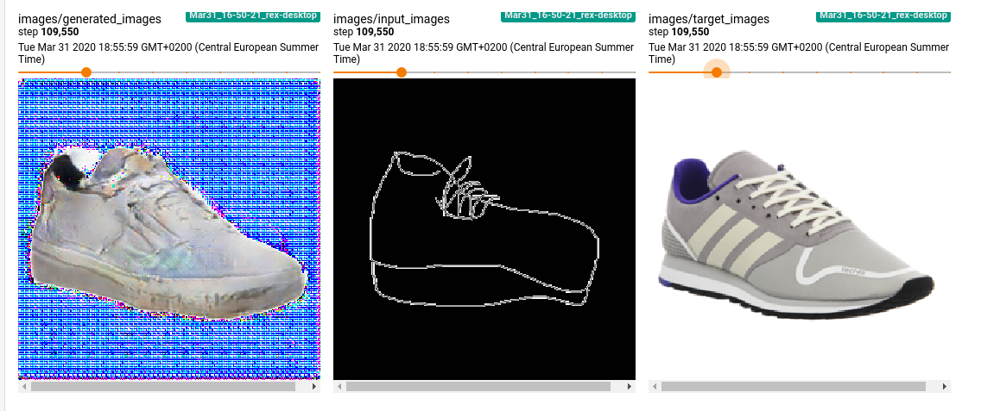
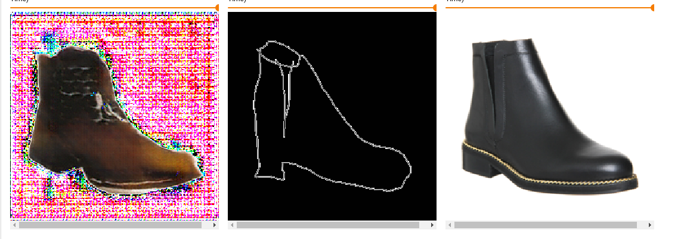

# GAN-experiments

This is my experiment repository for different GAN papers. For sometime it will mostly be unorganised but hopefully will grow into a library of useful losses, optimizers, layers etc. Unless otherwise credited i will re-write the code from scratch (just because it's more fun that way!)

## Implementations so far

1. [pix2pix](https://arxiv.org/abs/1611.07004)

## [pix2pix](./pix2pix/README.md) details

### Results

Trained on the [FACADE Dataset](http://cmp.felk.cvut.cz/~tylecr1/facade/) for about 150 epochs

Following samples show the generated images

 

 


On the shoes dataset

Left to right -> Generated image, input sketch, target image




I haven't optimized any hyper-parameters or trained enough since this is just for fun!

### Train
 
 Change the dataset directories in the dataloader inside teh script and call
 
```python pix2pix/pix2pix.py```

### @TODO 

- [ ] Add argument parser 
- [ ] Clean-up network configs
