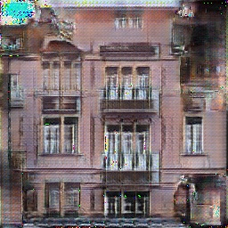
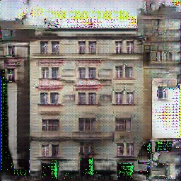

# GAN-experiments

pix2pix, CycleGAN, StyleGAN2 etc - experiment repositoty

## [pix2pix](./pix2pix/README.md) results

Trained on the [FACADE Dataset](http://cmp.felk.cvut.cz/~tylecr1/facade/) for about 150 epochs

After 150 epochs

## CycleGAN results

@TODO
