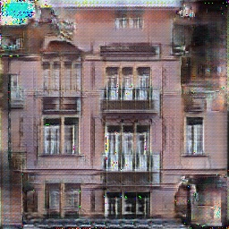
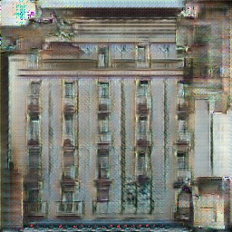
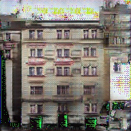

## pix2pix

From scratch implementation of [pix2pix](https://arxiv.org/abs/1611.07004), probably also the shortest out there. uses a UNet-style Generator instead of the typical ResNet style generator

Fun implementation, not optimised!

## Results

Trained on the [FACADE Dataset](http://cmp.felk.cvut.cz/~tylecr1/facade/) for about 150 epochs

After 150 epochs

@TODO: Train on the the [Shoes](https://www.eecs.qmul.ac.uk/~qian/Project_cvpr16.html) dataset

